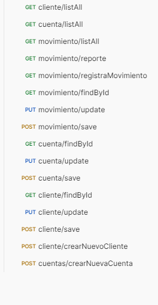
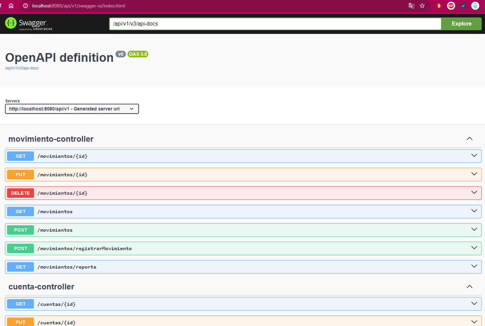

# Sistema de Gestión Bancaria

Este proyecto implementa una API de microservicios en Spring Boot para manejar operaciones bancarias que incluyen clientes, cuentas y movimientos. El sistema permite a los usuarios realizar operaciones CRUD sobre estas entidades, registrar movimientos y generar reportes de estado de cuenta.
## Características
CRUD Completo
Permite la creación, lectura, actualización y eliminación de entidades de Cliente, Cuenta y Movimiento a través de los siguientes endpoints:

## Registro de Movimientos
Permite registrar movimientos tanto positivos como negativos en las cuentas de los clientes, actualizando automáticamente el saldo disponible y llevando un registro de las transacciones.

## Reporte de Estado de Cuenta
Genera un reporte de estado de cuenta que incluye:

- Cuentas asociadas con sus respectivos saldos.
- Detalle de los movimientos de las cuentas.
Este reporte se puede obtener mediante:

GET http://localhost:8080/api/v1/movimientos/reporte?fechaInicio={fechaInicio}&fechaFin={fechaFin}&identificacion={identificacion}

## Documentación de la API

La documentación interactiva de la API está disponible a través de Swagger UI. Puedes acceder a ella navegando a la siguiente URL después de iniciar la aplicación:

[Swagger UI](http://localhost:8080/api/v1/swagger-ui/index.html)

Este enlace te permitirá explorar los endpoints disponibles, probarlos directamente desde tu navegador y ver las respuestas de la API en tiempo real.

